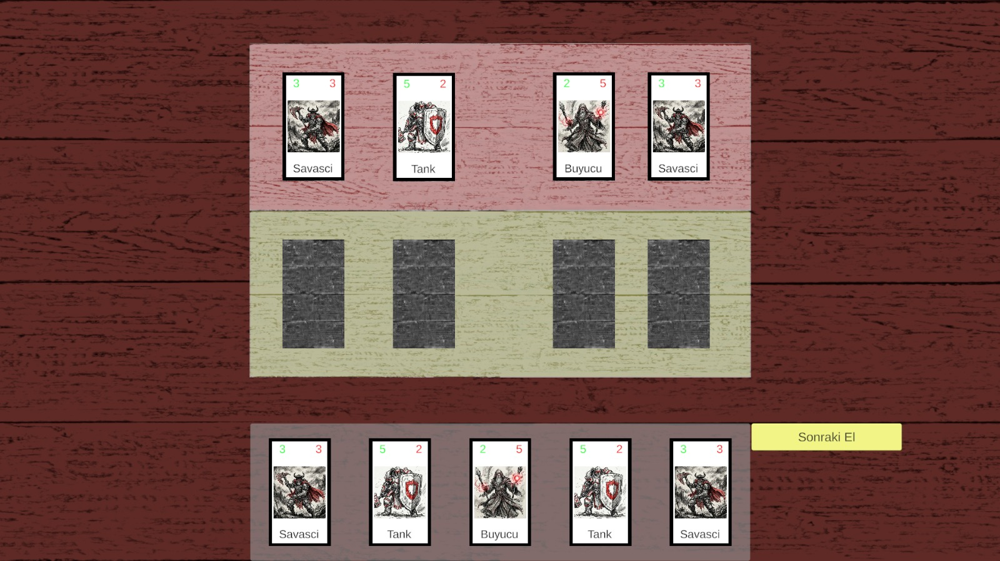
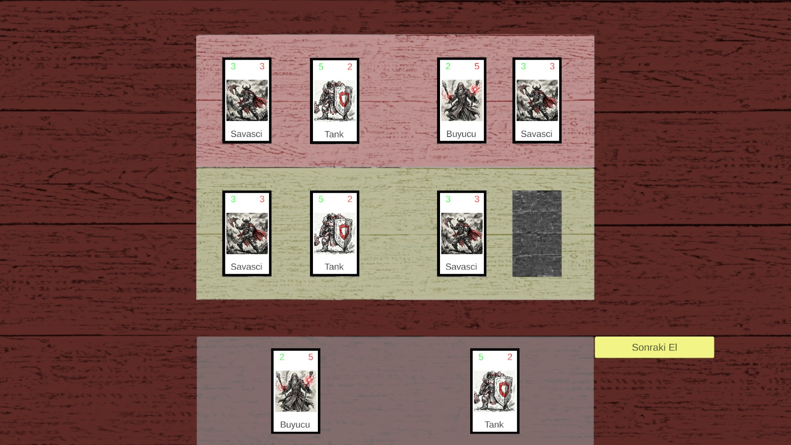

# 🎴 Dark-Ink Card Prototype

A minimalist, high-atmosphere card game prototype built in Unity, inspired by the lane-based combat mechanics of **Inscryption**. This project focuses on data-driven design, fluid drag-and-drop interactions, and a striking "Charcoal & Crimson" visual aesthetic.

---

## 🎨 Visual Identity

The game utilizes a "Selective Color" art style to maintain a dark fantasy atmosphere:
* **Monochrome Sketch:** Characters and environments are drawn with rough, messy charcoal pencil lines.
* **Vibrant Crimson:** Red is used exclusively for critical gameplay elements like Health, Attack, and magical effects to guide the player's focus.



---

## ⚙️ Core Mechanics

### 1. Data-Driven Cards (ScriptableObjects)
Instead of hard-coding every card, the system uses **ScriptableObjects**. This allows for:
* Easy creation of new cards (Warrior, Mage, Tank) without writing new code.
* Centralized balance tuning for Attack and Health values.

### 2. Lane-Based Combat (Inscryption-Inspired)
The board is divided into specific **Slots**. Cards are not played randomly; they are placed in lanes that dictate their targets.

* **Opposing Slots:** Each slot knows its direct rival.
* **Sequence Attack:** When the "End Turn" button is pressed, cards attack from left to right with a rhythmic delay.

!

### 3. Advanced Drag & Drop
* **Auto-Cleaning:** Slots automatically detect when a card is removed, clearing their memory to prevent "ghost attacks."
* **Physics-Based Feel:** Cards return to their original position if dropped in an invalid area.

---

## 🛠️ Technical Stack

* **Engine:** Unity 2022.3+
* **UI System:** Unity UI (uGUI) & TextMeshPro
* **Architecture:** Event-driven UI (IBeginDragHandler, IDropHandler)
* **Code Style:** Modular C# with Coroutines for combat sequencing

---

## 📝 Roadmap

    [ ] Mana System: Cards will have a blood/bone cost to be played.

    [ ] Enemy AI: An automated opponent that plays cards into empty slots.

    [ ] Juice & Polish: Screen shake on hit and particle effects for card destruction.

---

## 🚀 Getting Started

1.  **Clone the Repository:**
    ```bash
    git clone [https://github.com/yourusername/dark-ink-card-prototype.git](https://github.com/yourusername/dark-ink-card-prototype.git)
    ```
2.  **Open in Unity:** Launch Unity Hub and open the project folder.
3.  **Setup Scene:** Open `Assets/Scenes/GameScene`.
4.  **Play:** Press the Play button. Drag a card from your hand into a player slot and click the **Red Button** to see the combat loop in action.

---

## 📂 Project Structure

```text
Assets/
 ├── Scripts/           # Logic for CardDisplay, Dragging, and Turn Management
 ├── ScriptableObjects/ # Data templates for Warrior, Mage, etc.
 ├── Sprites/           # Charcoal-style artwork and UI assets
 └── Prefabs/           # Pre-configured Card and Slot templates
